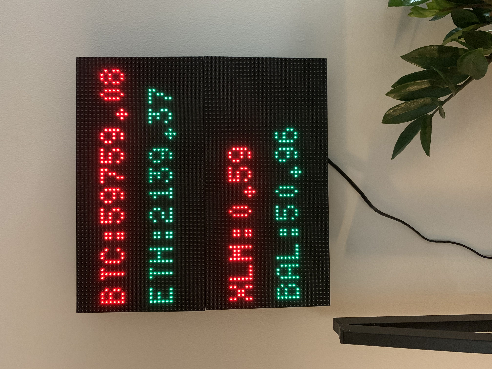

# coinbase_rpi_led_display
Display live crypto prices using a raspberry pi, Coinbase's API, and 2 LED panels. The top panel will always show BTC & ETH prices, while the
bottom panel will rotate through a list of altcoins. Green indicates an uptick and red indicates a downtick.



The physical display is built using a Raspberry Pi Zero WH and 2 [Adafruit 64x32 RGB LED Matrices](https://www.adafruit.com/product/2277).

The live pricing data is supplied by Coinbase's API using the very helpful [cryptofeed](https://github.com/bmoscon/cryptofeed) python package. Only trading pairs supported by Coinbase can be displayed.
I use the [rpi-rgb-led-matrix](https://github.com/hzeller/rpi-rgb-led-matrix) library to control the LED panels with my raspberry pi.
The python script works by extending the SampleBase class provided in "rpi-rgb-led-matrix\bindings\python\samples\samplebase.py".

### Steps
1. Follow [these instructions](https://howchoo.com/pi/raspberry-pi-led-matrix-panel) to physically setup the raspberry pi and LED panel and stop at step #8 (skip optional #6 and #7). I used the exact components that article listed.
There are some caveats because I use 2 panels. For step #4, also connect power to the second panel. The power cable that came with the LED panel had 2 power connections.
For step #5, an additional ribbon cable must be connected from the output port of the 1st panel to the input port of the 2nd panel. Follow the arrows
to easily identify input and output.
2. SSH into your raspberry pi and clone the rpi-rgb-led-matrix repo.
```bash
sudo apt-get update && sudo apt-get install -y git python3-dev
git clone https://github.com/hzeller/rpi-rgb-led-matrix.git
```
3. Clone my repo, install the pipenv environment and activate it.
```bash
git clone https://github.com/azflin/coinbase_rpi_led_display
pipenv install
pipenv shell
```
4. Cd back into rpi-rgb-led-matrix and install the library's python binding.
```bash
make build-python PYTHON=$(which python3)
sudo make install-python PYTHON=$(which python3)
```
5. Finally run the script and never have to check your phone again for crypto prices!
```bash
sudo python3 main.py --led-cols=64 --led-gpio-mapping=adafruit-hat --led-chain=2
```
